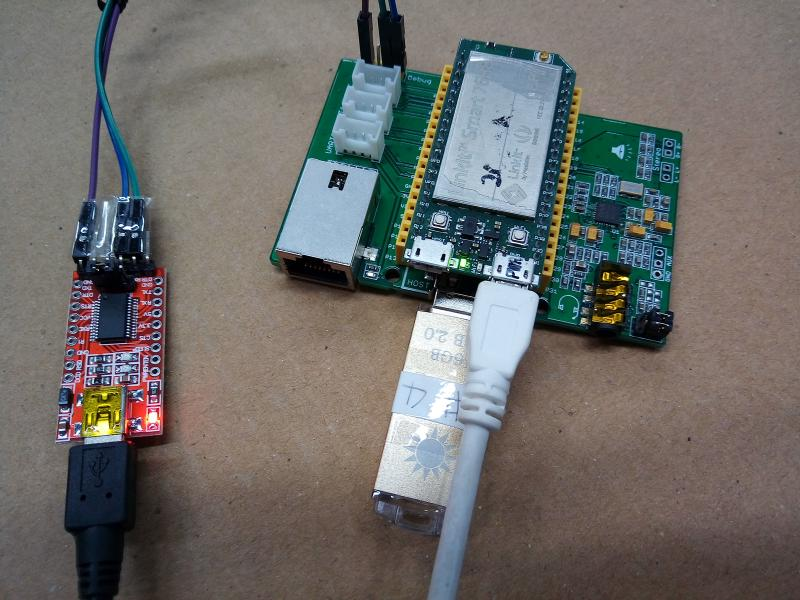
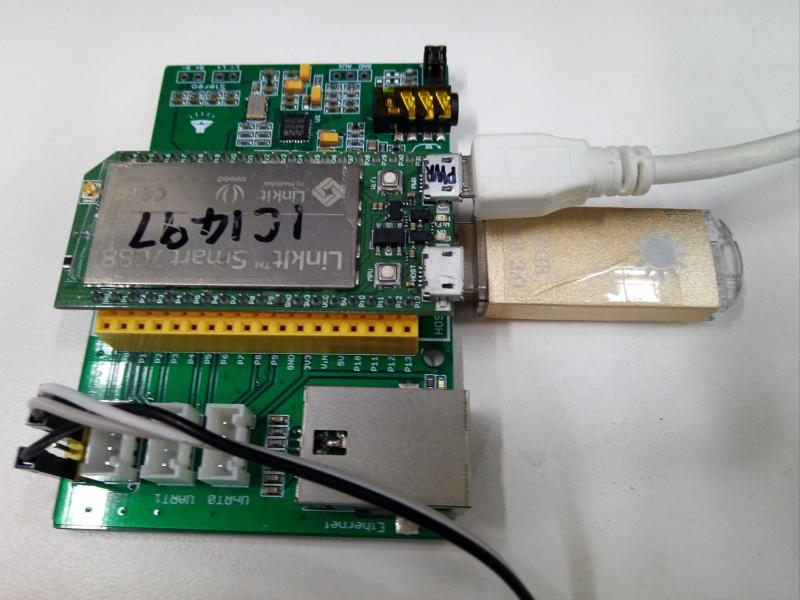
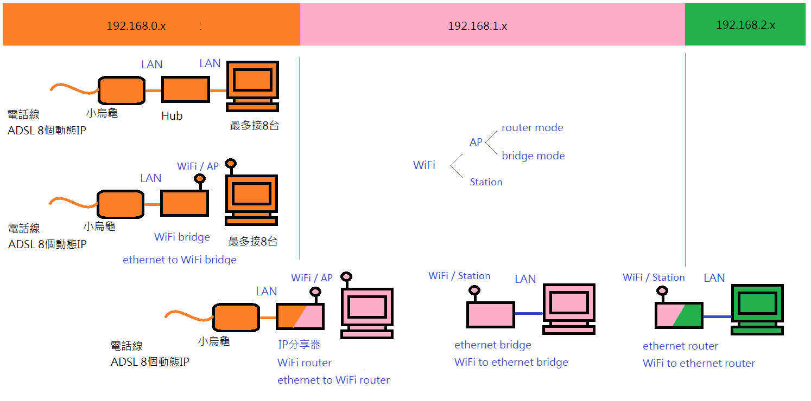
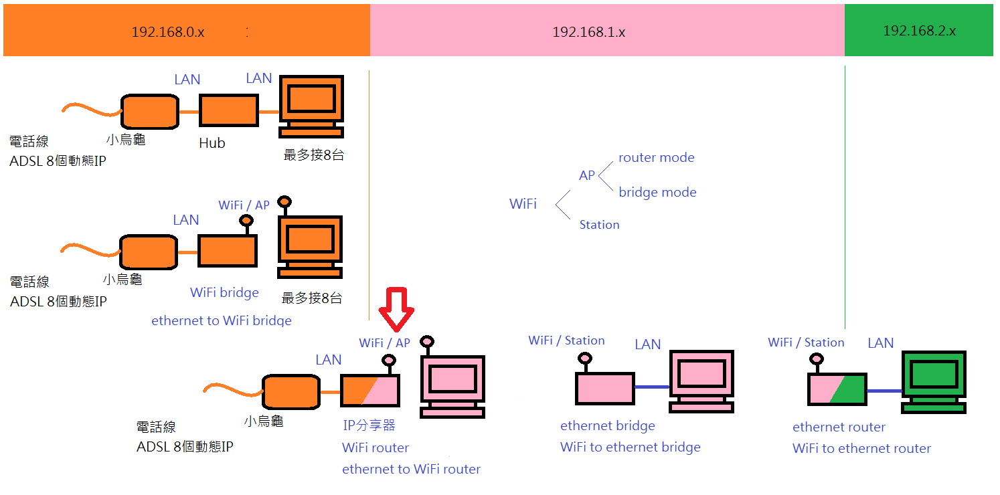
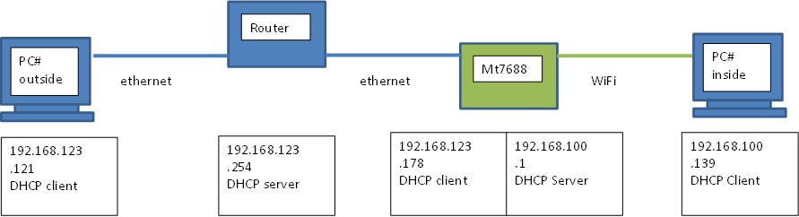
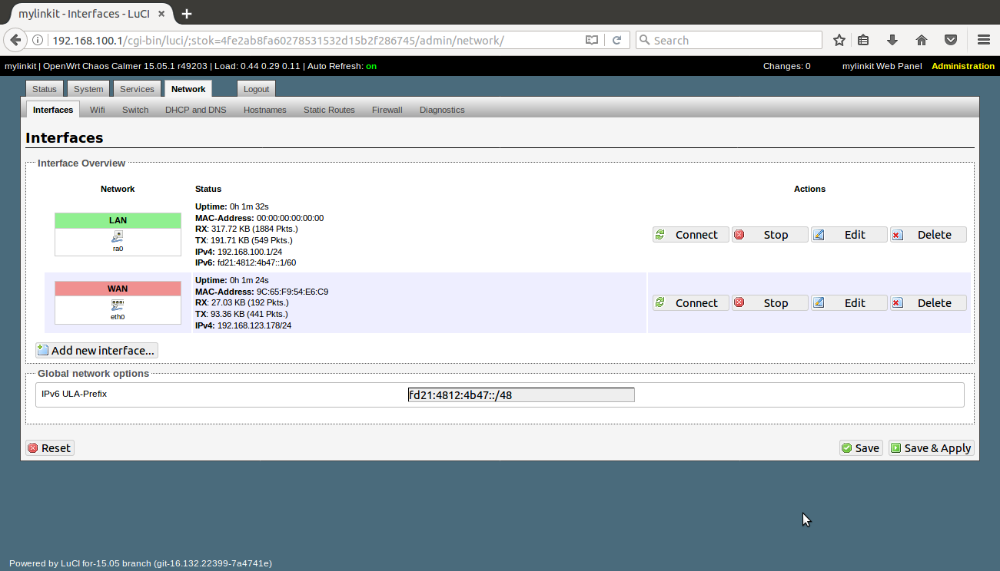
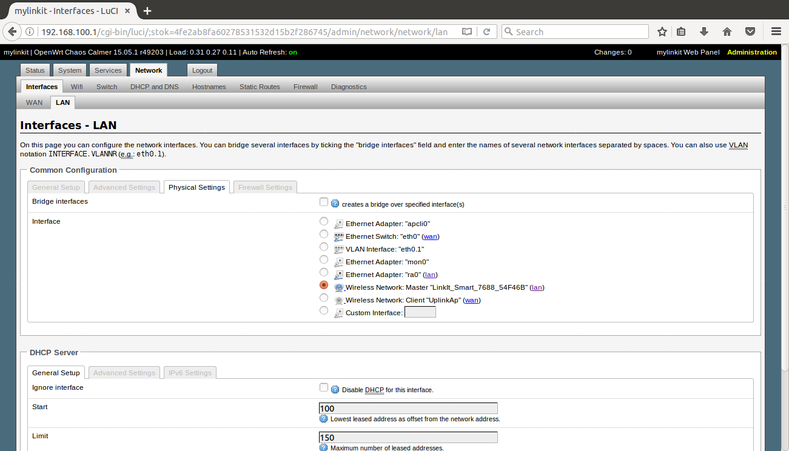
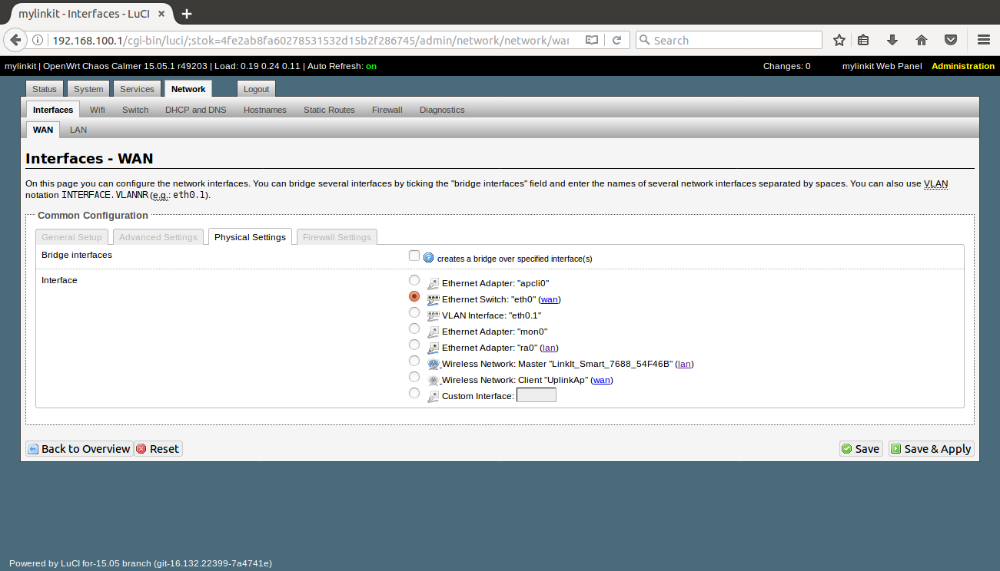

# 3.18.23 image, update by USB
## For USB rescue  
base_image_0.94_3.18.23/lks7688.img  
dffa59d1650497662b7ea53ca41701bd  
This image seems be factory image for Linkit 7688 / 7688 Duo.  
This version is fully supportted by opkg, https://archive.openwrt.org/chaos_calmer/15.05.1/ramips/mt7688/.  
救磚   

## Caution  
### copy lks7688.img to a clean usb disk with FAT32 format.
### First boot, please wait 2minutes or run command of sync to wait all works is finished.

   
   

Press WiFi key and power on linkit7688  
   

After 10 sec and release WiFi ky, linkit7688 finds the USB disk, file, and update itself.
   

Conneting type 2  
   

Conneting type 3  
   

# 3.18.23 image, update by mtd
mtd_update_3.18.23/LinkIt_Smart_7688_Firmware_v0.9.4.zip 
extract and copy the lks7688.img to USB disk.   

Boot linkut7688 to linux  

Update by :  

## mtd -r write /tmp/run/mounted/sd1/lks7688.img firmware  

Thus, if you want use this image, you maybe need to update 3.18.109 by USB or you board is ok for booting to  linux,  

then update this image by command of mtd.  

# linkit7688_3.18.109 image
usb_update_3.18.109/lks7688.img  
For USB rescue

# linkit7688duo MCU rescue
You can find Caterina-smart7688.hex at arduino for linkit7688duo:  
C:\Users\greatcat\AppData\Roaming\Arduino15\packages\LinkIt\hardware\avr\0.1.8\bootloaders\caterina  
 
copy Caterina-smart7688.hex to linkit7688duo by scp  
and run the command as below:  
avrdude -p m32u4 -c linuxgpio -v -e -U flash:w:Caterina-smart7688.hex -U lock:w:0x0f:m  

# example of uci
ONLY for owrt=15.x / k=3.18.x  
## sta mode
uci set dhcp.lan.ignore='0' &&\  
uci set network.lan.proto='static' &&\  
uci set wireless.radio0.linkit_mode='' &&\  
uci set wireless.ap.ssid='xxxxxxxxx' &&\  
uci set wireless.ap.key='xxxxxxxxx' &&\  
uci set wireless.ap.encryption='' &&\  
uci set wireless.sta.disable=0 &&\  
uci set wireless.sta.network='wan' &&\  
uci set wireless.sta.ssid=greatcat3 &&\  
uci set wireless.sta.key=123456789 &&\  
uci set wireless.sta.encryption=psk2 &&\  
uci commit  
 
wifi_mode sta  
 
Mt7688 as ethernet bridge. Browser -> PC -> ethernet -> mt7688 -> WiFi -> phone  
 
## ap mode
uci set dhcp.lan.ignore='0' &&\  
uci set network.lan.proto='static' &&\  
uci set wireless.radio0.linkit_mode='ap' &&\  
uci set wireless.ap.ssid='LinkIt_Smart_7688_1C1497a' &&\  
uci set wireless.ap.key='123456aaa' &&\  
uci set wireless.ap.encryption='psk2' &&\  
uci set wireless.sta.disable=1 &&\  
uci set wireless.sta.network=''  &&\  
uci set wireless.sta.ssid='xxxxxxxxx' &&\  
uci set wireless.sta.key='xxxxxxxxx' &&\  
uci set wireless.sta.encryption='psk2' &&\  
uci commit 
 
wifi_mode ap 

## WiFi router mode
 
 
 
 
 

If the document help you, how about buy street cats a fish can ?
