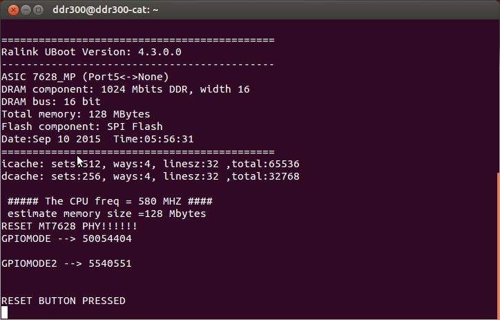
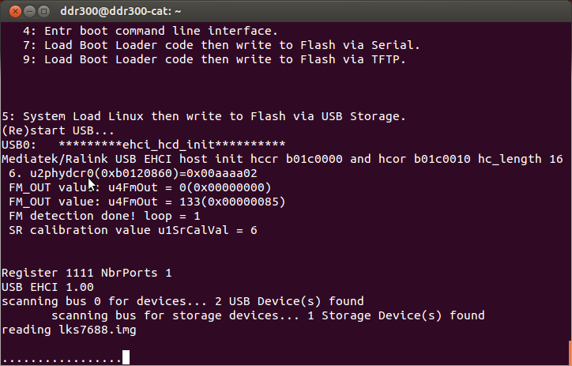

# linkit7688_3.18.109.img
For USB rescue  
救磚  

## Caution , copy lks7688.img to a clean usb disk with FAT32 format.

   

Press WiFi key and power on linkit7688  
   

After 10 sec and release WiFi ky, linkit7688 finds the USB disk, file, and update itself.
   
